# LB2_project_Group_7

## Data collection
Retrieved data from UniProt with a specific query (first filtering) and then polished the .tsv datasets from entries whose cleavage was absent or unknown (second filtering). The final collection of data consisted of these numbers of entries: 

| Dataset  | Entries    | %      |
|----------|-----------:|-------:|
| (+) Positive | **2,956**  | 12.4%  |
| (-) Negative | **20,974** | 87.6%  |

## Data preparation
Results in .fasta format were aligned and clustered with mmseqs, and one representative of each cluster was copied in a new .tsv file and labelled with "0" (negatives) or "1" (positives). 
The representatives were shuffled and then split between the training (80% of positives and 80% of negatives) and the benchmark dataset (remaining 20% of both). 

The previous labelling was useful to split the training dataset in 5 subsets, each with 20% of both positives and negatives (in this way, the ratio will be constant among all the subsets). 

### Training sets

| Subset    | (+) Positives | (-) Negatives | Total      | % of dataset |
|-----------|----------:|----------:|-----------:|-------------:|
| sub_1     | 177       | 1454      | 1631       | 16.0%        |
| sub_2     | 176       | 1453      | 1629       | 16.0%        |
| sub_3     | 177       | 1453      | 1630       | 16.0%        |
| sub_4     | 176       | 1453      | 1629       | 16.0%        |
| sub_5     | 176       | 1453      | 1629       | 16.0%        |
| bench     | 220       | 1816      | 2036       | 20.0%        |
| **Total** | **1102**  | **9082**  | **10184**  |              |

## Data visualization

### Protein length distribution
| Training | Benchmark |
|---|---|
| 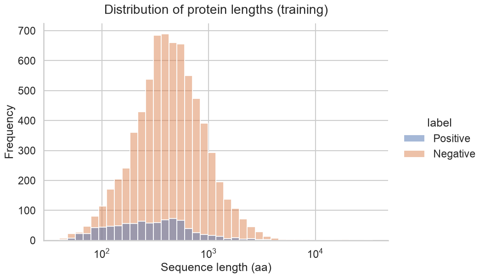 | 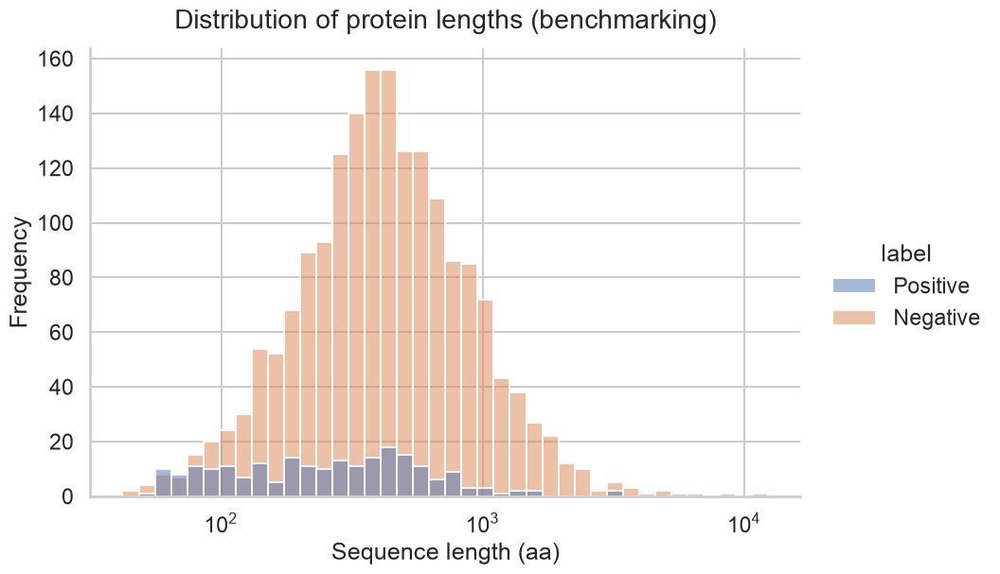 |

### Signal peptide length distribution ~ positives
| Training | Benchmark |
|---|---|
| 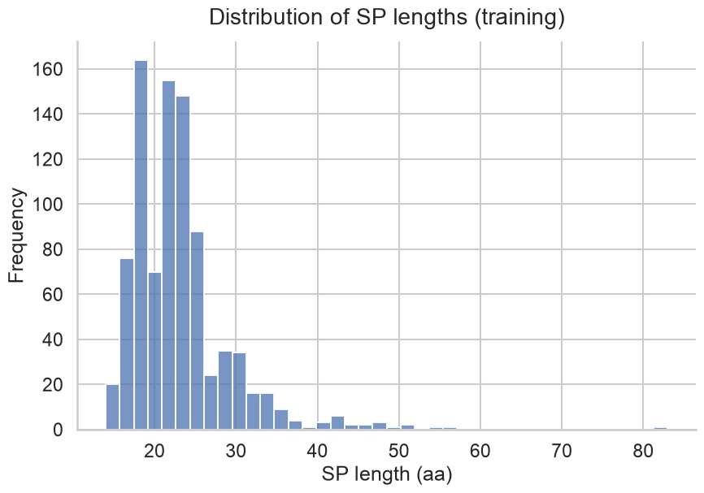 | 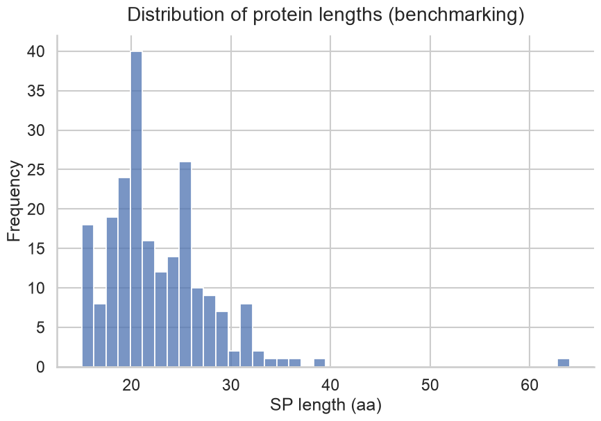 |

### Amino-acid composition (SP vs Background)
| Training | Benchmark |
|---|---|
| 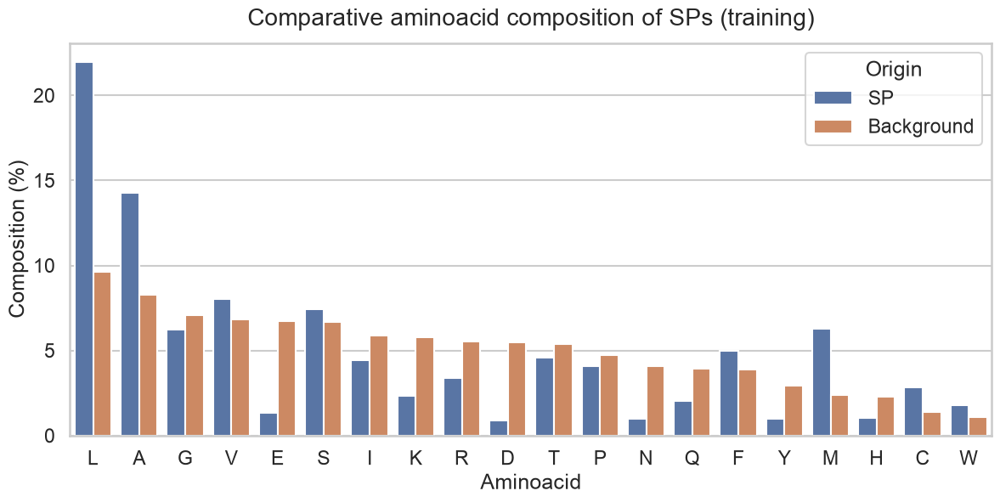 | 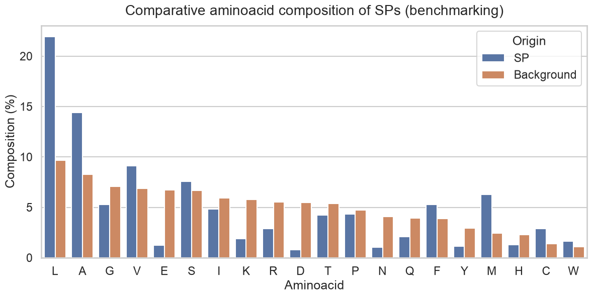 |

### Taxonomic classification ~ kingdom
| Training (positives) | Training (negatives) |
|---|---|
|  | 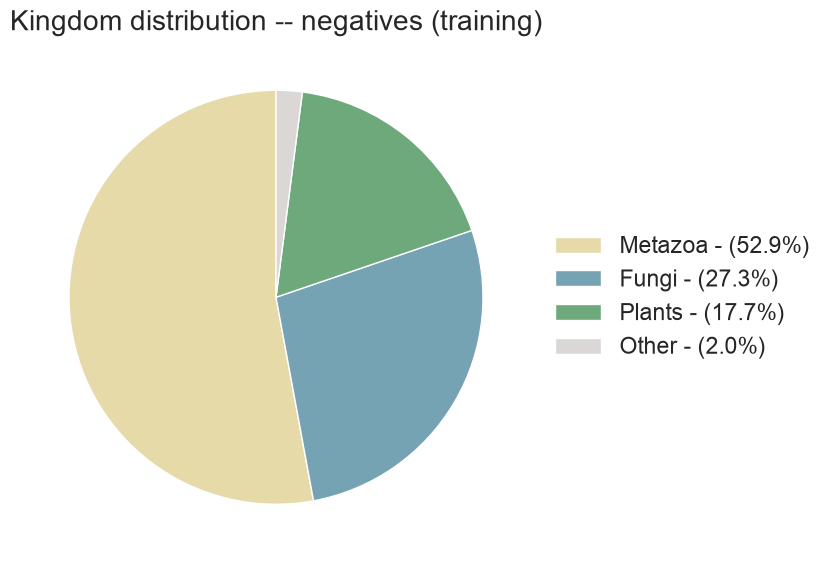 |

| Benchmark (positives) | Benchmark (negatives) |
|---|---|
| 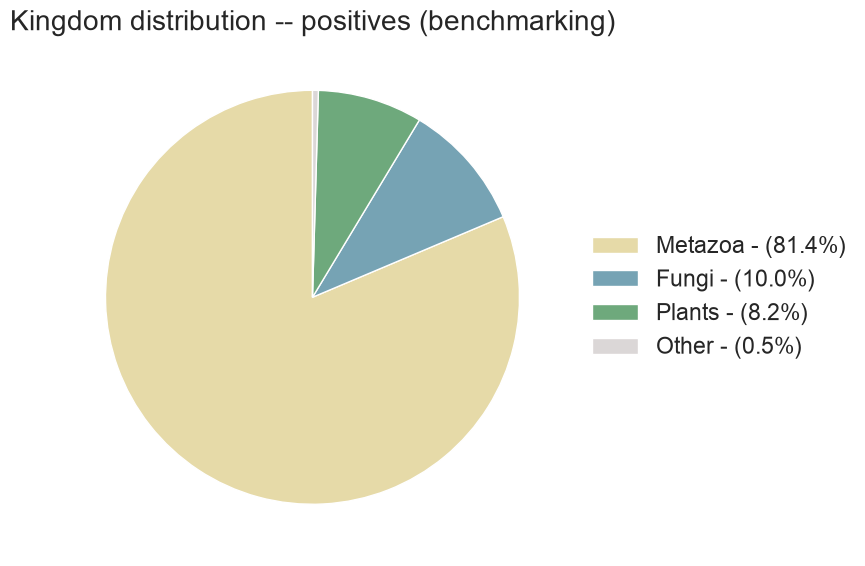 | 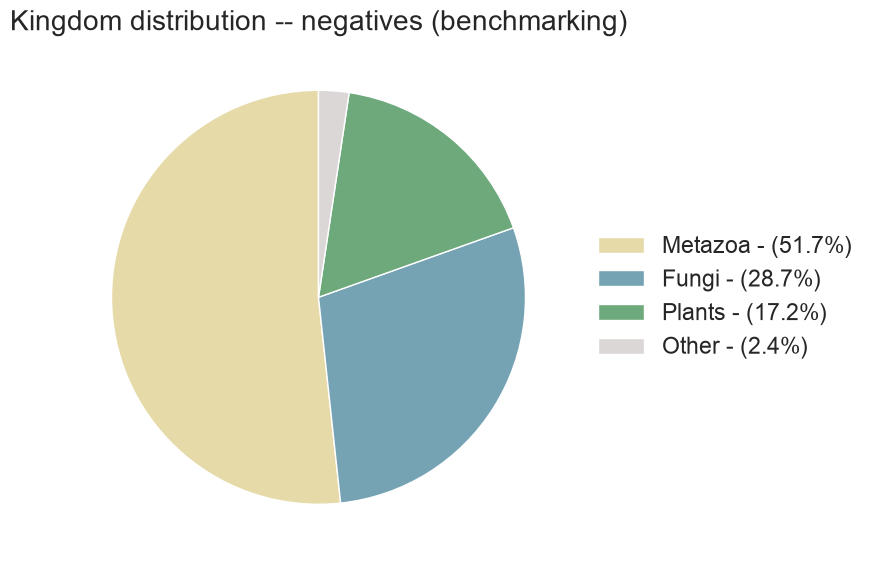 |

### Taxonomic classification ~ species
| Training (positives) | Training (negatives) |
|---|---|
|  | 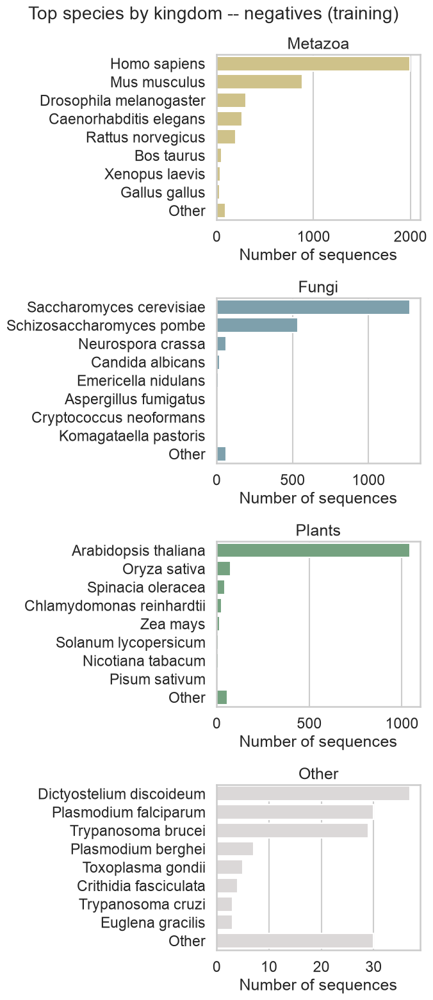 |

| Benchmark (positives) | Benchmark (negatives) |
|---|---|
| 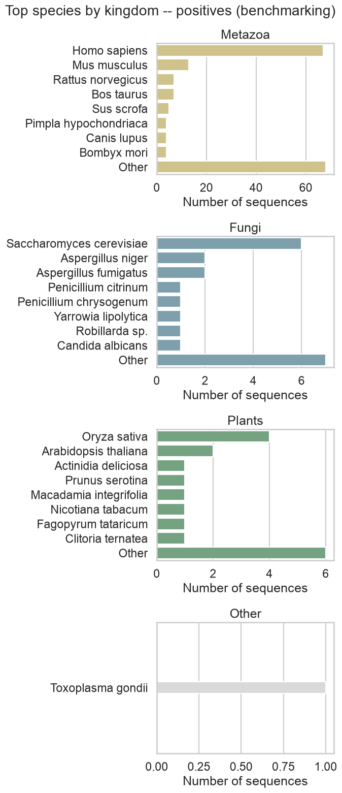 | 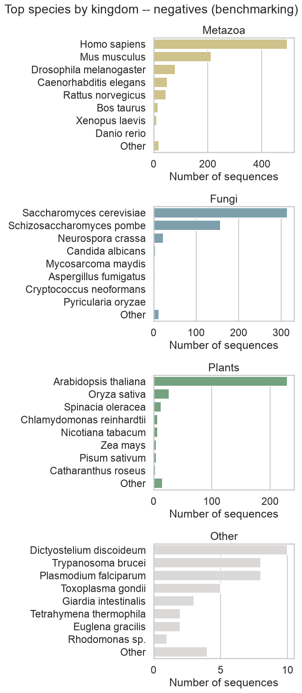 |
