# LB2_project_Group_7

## Data collection
Data were retrieved from UniProt with a specific query (first filtering) and then polished the .tsv datasets from entries whose cleavage was absent or unknown (second filtering). The final collection of data consisted of these numbers of entries: 

| Dataset  | Entries    | %      |
|----------|-----------:|-------:|
| (+) Positive | **2,956**  | 12.4%  |
| (-) Negative | **20,974** | 87.6%  |

## Data preparation
Results in .fasta format were aligned and clustered with mmseqs, and one representative of each cluster was copied in a new .tsv file and labelled with "0" (negatives) or "1" (positives). 
The representatives were shuffled and then split between the training (80% of positives and 80% of negatives) and the benchmark dataset (remaining 20% of both). 

The previous labelling was useful to split the training dataset in 5 subsets, each with 20% of both positives and negatives (in this way, the ratio will be constant among all the subsets). 

### Training sets

| Subset    | (+) Positives | (-) Negatives | Total      | % of dataset |
|-----------|----------:|----------:|-----------:|-------------:|
| sub_1     | 177       | 1454      | 1631       | 16.0%        |
| sub_2     | 176       | 1453      | 1629       | 16.0%        |
| sub_3     | 177       | 1453      | 1630       | 16.0%        |
| sub_4     | 176       | 1453      | 1629       | 16.0%        |
| sub_5     | 176       | 1453      | 1629       | 16.0%        |
| bench     | 220       | 1816      | 2036       | 20.0%        |
| **Total** | **1102**  | **9082**  | **10184**  |              |

## Data visualization

### Protein length distribution
| Training | Benchmark |
|---|---|
| 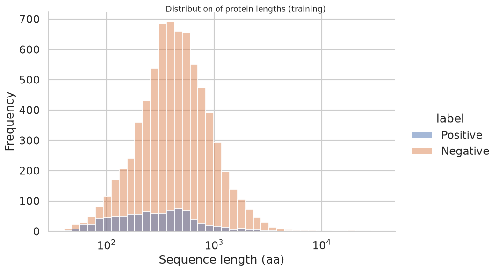 | 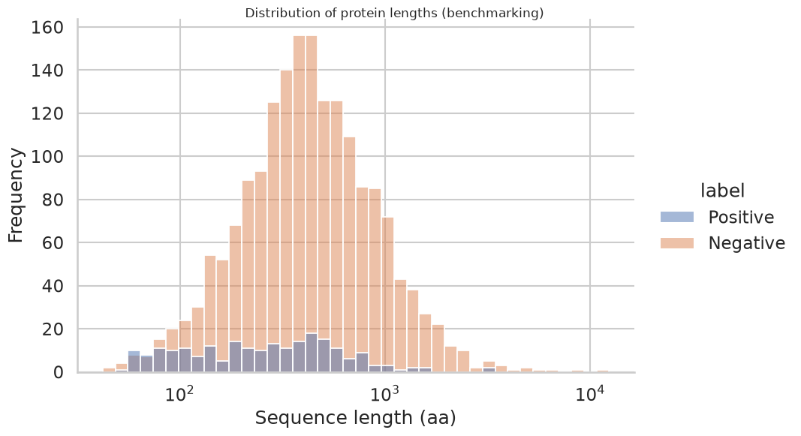 |

### Signal peptide length distribution ~ positives
| Training | Benchmark |
|---|---|
|  | 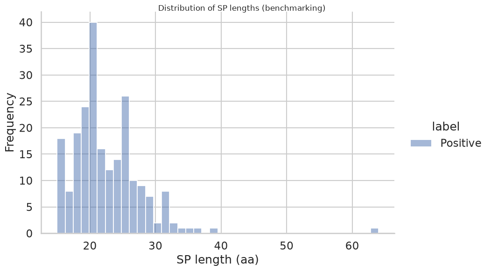 |

### Amino-acid composition (SP vs Background)
| Training | Benchmark |
|---|---|
| 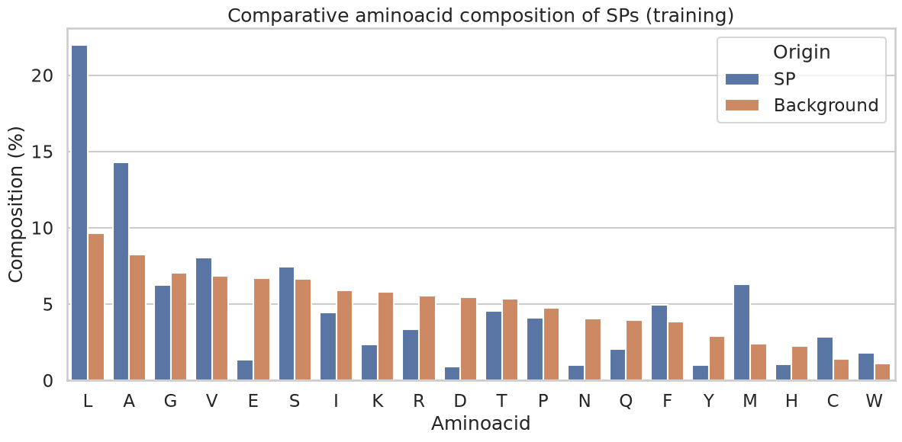 | 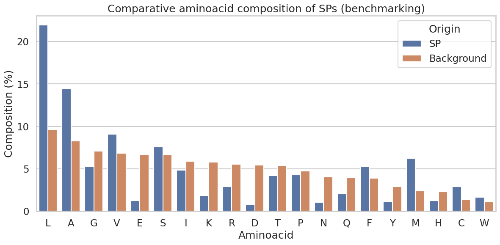 |

### Taxonomic classification ~ kingdom
| Training (positives) | Training (negatives) |
|---|---|
| 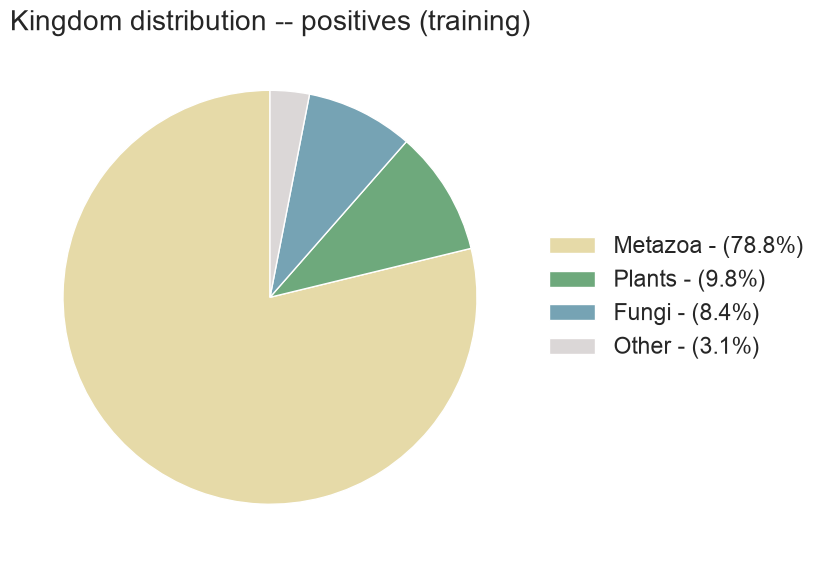 | 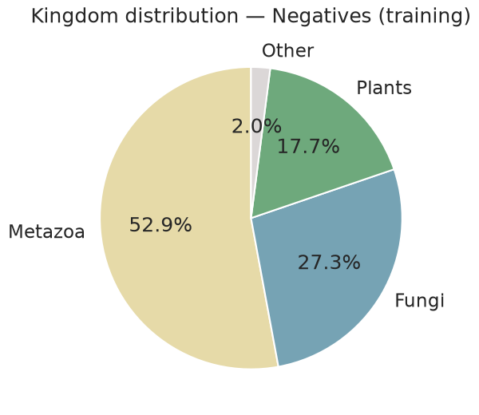 |

| Benchmark (positives) | Benchmark (negatives) |
|---|---|
| 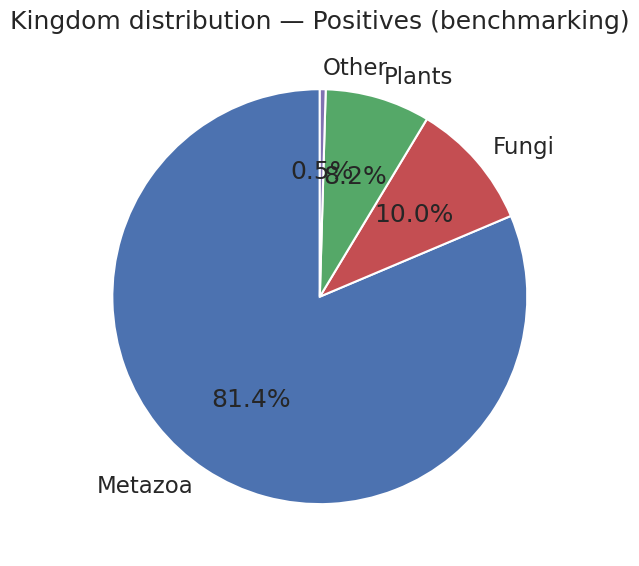 | 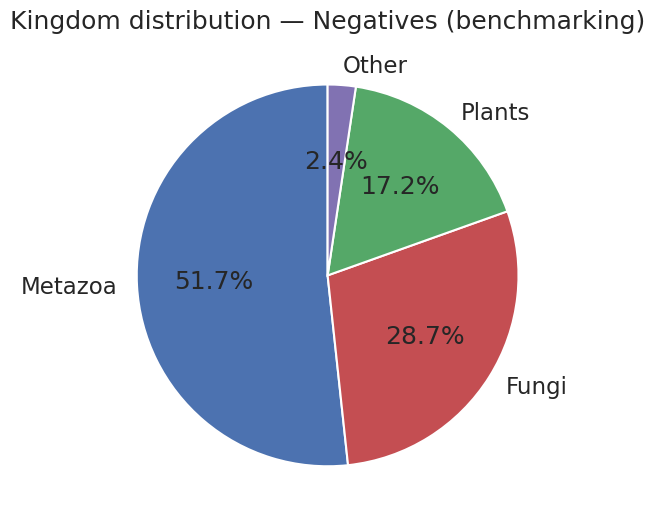 |

### Taxonomic classification ~ species
| Training (positives) | Training (negatives) |
|---|---|
| 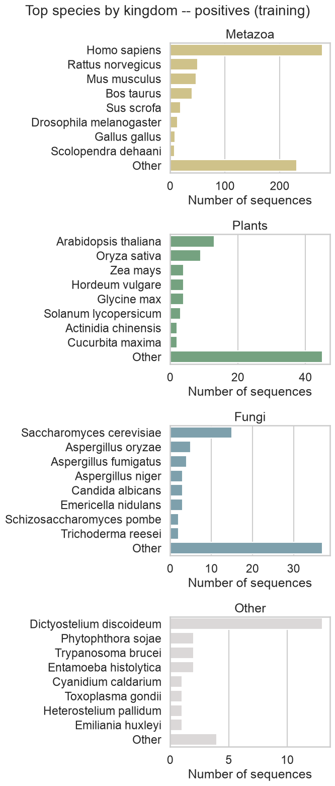 |  |

| Benchmark (positives) | Benchmark (negatives) |
|---|---|
| 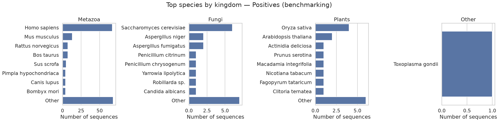 | 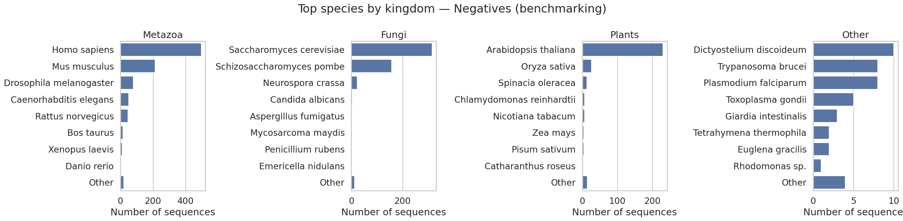 |

### von Heijne method for signal-peptide detection

The **von Heijne method** is a statistical sequence-profiling framework for detecting and discriminating signal peptide cleavage junctions in primary protein structures and modeling the amino-acid distribution around known cleavage sites.

The model is parameterized as a Position-Specific Weight Matrix (**PSWM**) estimated across a fixed asymmetric local window spanning coordinates **[-13, +2]** relative to the cleavage junction. A pseudocount of 1 is applied to positional counts. Positional emission probabilities $p_{i,a}$ across validated cleavage sites are compared against an empirical background amino acid distribution $q_a$ derived from UniProtKB/Swiss-Prot composition, yielding position-dependent log-odds weights:

$$W_{i,a} = \ln\left(\frac{p_{i,a}}{q_a}\right)$$

By sliding this scoring window across the first 90 N-terminal residues of a target sequence, the model predicts cleavage sites at the positions that achieve the highest scores.

---

## 5-Fold Cross-Validation Workflow

To calibrate the decision threshold and evaluate classification performance without data leakage, a 5-fold cross-validation scheme was performed. For each run $j \in \{1, \dots, 5\}$:
- **Training (3 folds, 60%):** Cleavage contexts of positive sequences were used to build a fold-specific PSWM.
- **Validation (1 fold, 20%):** Scored with the PSWM to determine the optimal decision threshold by maximizing the $F_1$-score on the Precision-Recall curve.
- **Test (1 fold, 20%):** Evaluated strictly on unseen sequences using the calibrated threshold to compute test metrics.

### Cross-Validation Performance

The summary of test metrics across all 5 runs ($\text{mean} \pm \text{standard error}$):

| Metric | Mean ± SE |
| :--- | :---: |
| **Precision** | 0.6953 ± 0.0322 |
| **Recall** | 0.7426 ± 0.0144 |
| **Accuracy** | 0.9358 ± 0.0061 |
| **MCC** | 0.6819 ± 0.0217 |
| **F1** | 0.7163 ± 0.0194 |

### Per-Run Results

| Run | Threshold | TP | FP | TN | FN | Precision | Recall | Accuracy | MCC | F1 |
| :---: | :---: | :---: | :---: | :---: | :---: | :---: | :---: | :---: | :---: | :---: |
| **1** | 6.568 | 123 | 50 | 1404 | 54 | 0.711 | 0.695 | 0.936 | 0.667 | 0.703 |
| **2** | 5.691 | 130 | 96 | 1357 | 46 | 0.575 | 0.739 | 0.913 | 0.604 | 0.647 |
| **3** | 5.964 | 139 | 62 | 1391 | 38 | 0.692 | 0.785 | 0.939 | 0.703 | 0.735 |
| **4** | 6.576 | 132 | 42 | 1411 | 44 | 0.759 | 0.750 | 0.947 | 0.725 | 0.754 |
| **5** | 6.445 | 131 | 46 | 1407 | 45 | 0.740 | 0.744 | 0.944 | 0.711 | 0.742 |

---

## Final PSWM Model

Once the approach was validated, the definitive matrix (`pswm_final.tsv`) was trained on **100% of the positive training contexts** to minimize estimation variance for rare amino acids. 

The operational decision threshold was set to the mean optimal threshold obtained during cross-validation:

$$\theta_{\text{final}} = \frac{6.568 + 5.691 + 5.964 + 6.576 + 6.445}{5} = \mathbf{6.2488}$$

### Final Log-Odds PSWM (Positions [-13, +2])

| Pos | A | R | N | D | C | Q | E | G | H | I | L | K | M | F | P | S | T | W | Y | V |
| :---: | :---: | :---: | :---: | :---: | :---: | :---: | :---: | :---: | :---: | :---: | :---: | :---: | :---: | :---: | :---: | :---: | :---: | :---: | :---: | :---: |
| **-13** | 0.22 | -1.96 | -3.60 | -2.29 | 0.87 | -2.47 | -2.49 | -0.82 | -1.41 | 0.12 | 1.39 | -2.16 | -0.08 | 0.84 | -1.12 | -0.31 | -0.83 | 0.41 | -1.07 | 0.53 |
| **-12** | 0.31 | -3.91 | -2.21 | -3.90 | 0.69 | -2.47 | -3.41 | -1.38 | -1.93 | 0.18 | 1.50 | -2.86 | -0.37 | 0.83 | -1.12 | -0.66 | -0.79 | 0.79 | -1.48 | 0.47 |
| **-11** | 0.21 | -2.52 | -2.50 | -3.90 | 0.97 | -1.49 | -4.10 | -0.86 | -1.64 | 0.36 | 1.38 | -3.95 | -0.19 | 0.40 | -0.87 | -0.49 | -0.41 | 0.64 | -1.48 | 0.69 |
| **-10** | 0.24 | -2.30 | -2.21 | -3.20 | 0.97 | -1.27 | -2.72 | -0.42 | -1.93 | 0.18 | 1.46 | -2.86 | -0.31 | 0.71 | -1.36 | -0.43 | -0.70 | -0.11 | -1.66 | 0.33 |
| **-9** | 0.77 | -2.81 | -1.65 | -2.11 | 0.97 | -1.78 | -2.72 | -0.42 | -1.23 | -0.31 | 1.34 | -3.96 | -0.08 | 0.49 | -1.12 | -0.05 | -0.70 | -0.22 | -1.19 | 0.17 |
| **-8** | 0.73 | -2.52 | -1.99 | -1.95 | 1.36 | -0.57 | -2.02 | -0.52 | -1.64 | -0.48 | 1.11 | -2.86 | 0.14 | 0.47 | -1.45 | 0.25 | -0.22 | 0.41 | -0.56 | 0.17 |
| **-7** | 0.35 | -1.34 | -1.30 | -2.29 | 1.28 | -0.68 | -2.16 | -0.35 | -1.64 | -0.17 | 1.25 | -1.76 | 0.10 | 0.72 | -0.67 | -0.17 | -0.19 | 0.69 | -0.71 | -0.21 |
| **-6** | 0.60 | -1.83 | -1.81 | -1.82 | 0.94 | -2.18 | -1.70 | -0.63 | -0.72 | 0.36 | 0.76 | -2.86 | -0.03 | 0.32 | 0.39 | -0.16 | -0.22 | 0.59 | -0.97 | 0.81 |
| **-5** | 0.65 | -0.73 | -0.60 | -1.01 | 0.36 | 0.24 | -0.73 | 0.53 | 0.31 | -0.98 | -0.42 | -1.18 | -0.37 | -0.66 | 0.65 | 0.60 | 0.49 | 0.00 | -0.87 | -0.21 |
| **-4** | 0.17 | -0.38 | -1.52 | -0.95 | 0.69 | -0.07 | -0.70 | 0.48 | -0.72 | -0.76 | 0.39 | -1.18 | -0.13 | -0.03 | 0.62 | 0.53 | 0.03 | 0.00 | -0.44 | 0.14 |
| **-3** | **1.20** | -2.30 | -1.52 | -2.51 | **1.57** | -2.87 | -2.31 | 0.25 | -2.33 | -0.57 | -0.88 | -2.35 | -1.29 | -2.17 | -1.56 | 0.67 | 0.56 | -1.61 | -3.27 | **1.12** |
| **-2** | 0.10 | 0.15 | -0.27 | -0.13 | -0.04 | 0.83 | 0.12 | -0.54 | 0.81 | -0.88 | 0.33 | -0.82 | -0.31 | -0.51 | -1.27 | 0.57 | -0.14 | 0.99 | -0.09 | -0.66 |
| **-1** | **1.76** | -1.20 | -1.81 | -1.95 | 0.91 | -0.93 | -2.49 | **1.09** | -2.33 | -3.28 | -2.07 | -2.01 | -1.69 | -1.94 | -0.26 | 0.58 | -0.70 | -2.30 | -1.88 | -3.02 |
| **+1** | 0.70 | -0.38 | -0.30 | 0.20 | 0.36 | 0.79 | 0.02 | -0.15 | 0.20 | -0.64 | -0.06 | -0.22 | -0.51 | -0.06 | -1.81 | 0.09 | -0.14 | 0.09 | -0.05 | -0.34 |
| **+2** | -0.57 | 0.06 | -0.10 | 0.20 | 0.36 | 0.22 | 0.37 | -0.19 | 0.07 | -0.64 | -0.75 | -0.17 | -1.69 | -0.37 | **1.09** | 0.41 | 0.01 | -0.36 | -0.05 | -0.25 |
